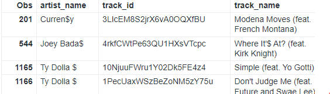
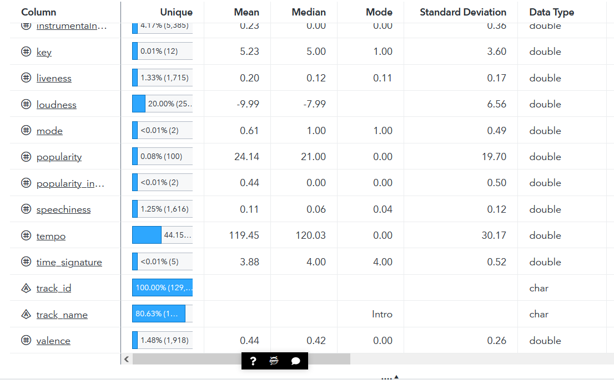
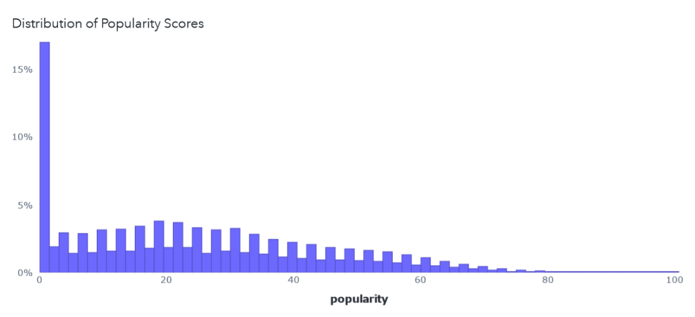
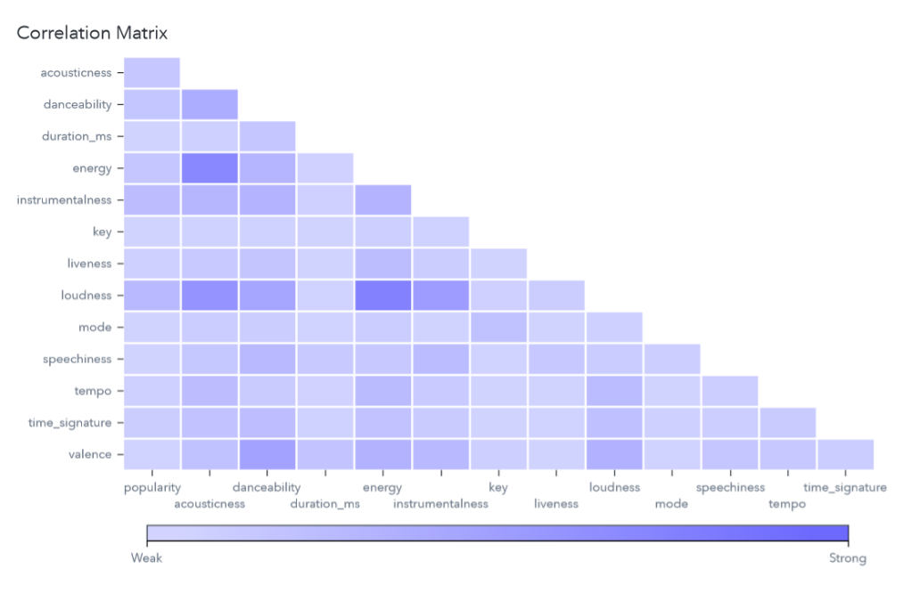
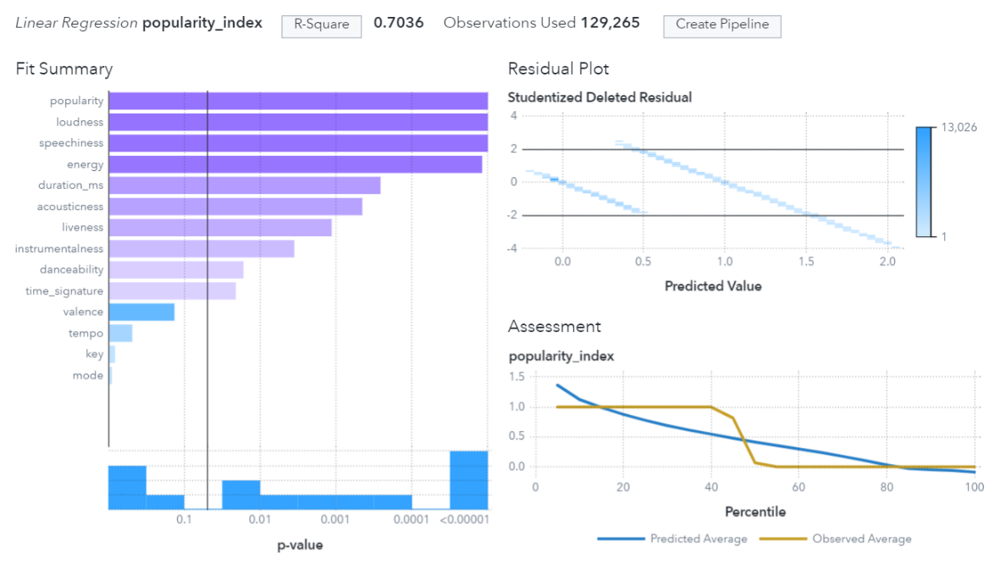
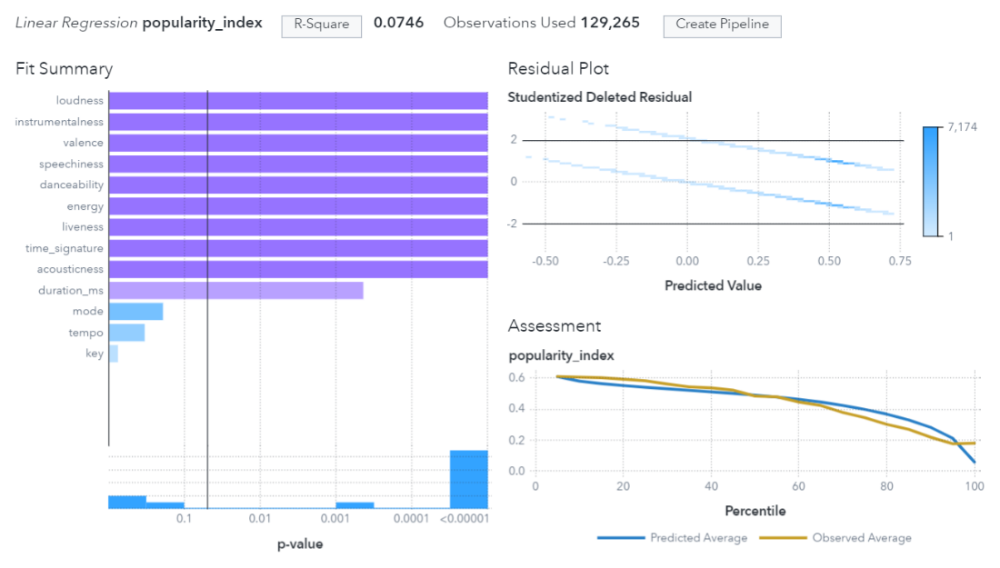
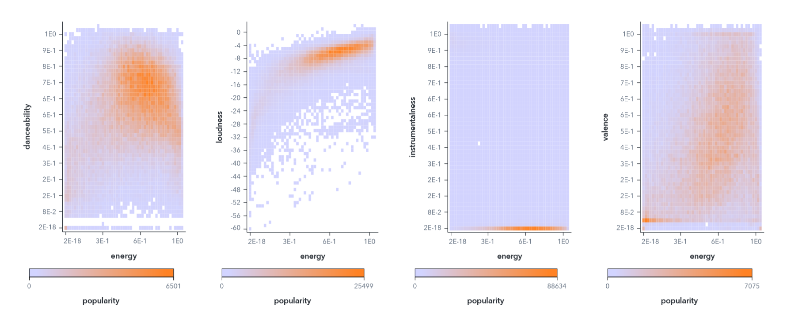
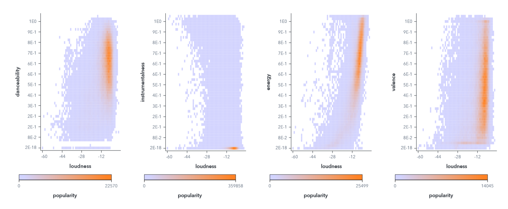
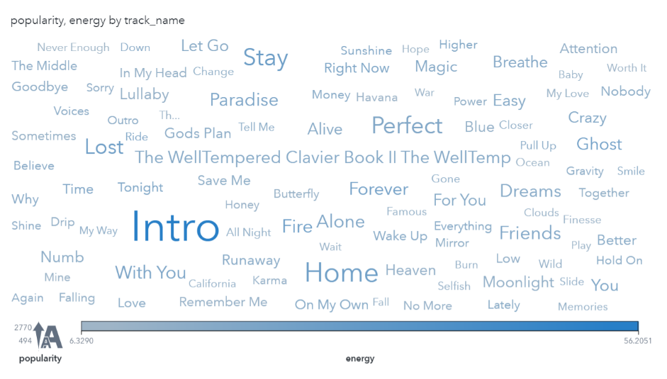

# THE CURIOSITY CUP 2022
## A Global SAS® Student Competition

MUSIC DNA: a Spotify Predictive Analysis

# Introduction

Music analysis and the music industry have drastically changed in the last few
decades. Tanks to applications like Spotify, we can read the behavior of music
consumers as well as the performance of songs and artists.

This project comes after the following question, *if we are able to compare
songs with different variables, measures, and popularity, can we predict whether
a song has chance of becoming popular or not?*

# Data

## Overview and Description

Spotify Developers offer the possibility to utilize Spotify data. One of them
are the audio features available via the Spotify official web API. There are
several datasets downloaded via the API that are later uploaded to Kaggle, but
for this project, we are using one of the most recent datasets, which was
generated in April 2019 with over 130,000 unique tracks.

As for the content of the data, each row (song) has values for artist name,
track name, track id, and different features that we will discuss further into
this report.

## Data Reference

The link to our dataset can be accessed here:
<https://www.kaggle.com/tomigelo/spotify-audio-features/home>. It was uploaded
by the user “tomigelo” to Kaggle, but the credit goes to Spotify for providing
this data via their web API.

## Raw data description

The dataset includes 130,663 unique songs of 34,509 unique artists. It includes
13 features for the song and a dependent variable of popularity.

The feature description table can be found in the appendix of this document. It
is taken from Spotify’s official website and is further referenced:
[https://developer.spotify.com/documentation/web-api/reference/\#/operations/get-audio-features](https://developer.spotify.com/documentation/web-api/reference/#/operations/get-audio-features).

# Data pre-processing and actions taken

**Data Cleaning:**

First, as part of data cleaning process, we check for invalid characters in
string variables Artist_name and Trackname. By running below piece of code we
are first checking if there are any observations appearing as ‘\$’ in place of
letter ‘S’.

proc print data=rawdata;

where artist_name like ‘%\$%’;

run;

Display 1. Dirty Data example

As seen on Display 1, for Obs 201 the artist_name is having unusual character \$
instead of letter S. We have the same case for other observations for the
variables artist_name and track_name. we change it to the correct letter using
SAS Translate function.

Then, we trim all leading and trailing space and remove other remaining special
characters and numeric values from string variables. We use SAS anyalpha
function to accommodate this change. Next, we use the SAS cmiss function to find
the rows that include complete cases.

Moreover, we add one extra column popularity Index to identify the popularity of
the song based on mean value of popularity variable. If the popularity is less
than mean value, then we mark popularity index as 0 else popularity index will
be 1.

As a last step, we run a Data Profile with the assistance of Prepare Data within
SAS Viya for Learners. As shown in Display 2, which is a screenshot of the Data
Profile, we can observe the data has a 100% uniqueness for track id. Finally,
there are no null values across our data.

Display 2. Cleaned Data Profile Example

# Analysis

Once the data is complete clean and pre-processed, we begin the data
exploration. For this step, we use “Explore and Visualize” within SAS Viya for
Learners.

## Exploratory data analysis

First, we take a look at how popularity scores are distributed:

Display 4. Distribution of Popularity Scores

We can observe that most songs are not popular. Actually, the majority of them
have a popularity score below 30, with a mean popularity score of 24.
Furthermore, we can infer that the dataset is not balanced, and a very small
portion of the songs have a popularity score of larger than 50 (10%).

Moreover, if we take a look at the correlation matrix not only for a better
understanding of what makes a song popular, but also to observe any potential
multicollinearity with the features.

Display 7. Correlation Matrix

As we can observe, there are not many issues of correlation, with the strongest
potential overlap being energy and loudness. Additionally, there isn’t a very
strong correlation between our independent variables and popularity, which could
have implications in our linear regressions and statistical modeling.

More exploratory analysis graphs can be found in the appendix of the document.

# statistical modeling

## linear regression

First, we decide to take a linear regression, not only because this is the
simplest model but also because it can already give us statistical insights
about popularity. However, based on the data from linear regression, we can come
to conclusions that will be useful to us when working with subsequent models.

Analyzing and working with linear regression, we came to ambiguous conclusions
related to the operation of the model and the relationship of its parameters.

Display 9. Linear Regression with Popularity

In the graph Display 9, we observe how the model behaves in the presence of a
popularity score, on which the popularity_index was based, which is our target
variable. Despite the fact that the indicator that directly determines the
variable target is present in the model, R-Square has a value of only 0.7036,
which is certainly a positive result, but does not give almost 100 percent
accuracy, which should be expected in this case.

However, after running the same model with different features, we observe the
same model, but without the popularity parameter. R-Square this time is 0.0746,
which is an extremely low result. Although the model does give us an idea of the
importance of parameters by p-value, by which we can see those features such as
mode, tempo and key have the least impact on the song's popularity, the issue
with the accuracy of the model and the influence of popularity remains
unresolved.

Display 10. Linear Regression without Popularity

But the answer to this question could be the fact that most people listen to the
music of already popular artists, without caring about the quality of the
musical composition. Because of this, when our algorithm tries to calculate the
relationship between the parameters, it does not see any correlation. Thus, we
can conclude that most people do not evaluate music by its quality indicators,
but only by the significance of the performer in principle.

# conclusions

Overall, this is a fun dataset to analyze and play around with. However, to
answer our first question, it is quite difficult to determine if a song may be
popular or not, at least with the available features.

After this analysis, we concluded that we may create a deeper and more precise
model by thinking of new variables with additional data:

-   Has an artist had a hit before? How many?

-   Can we classify artists by genre?

-   What artists have collaborated with each other and how does this impact
    their popularity?

For future work, we believe we can expand our research by running a revenue
analysis with additional linear and logistic regressions. If we include the
average revenue by song stream analyzed versus the song’s popularity, we could
perhaps predict the amount of money generated by a particular track.

Predicting the popularity of a song may be hard, but its not impossible. A tool
like this one could be of great use for artists, record labels and anyone within
the music industry.

**References**

Spotify for Developers. 2022. “Get Track's Audio Features”. Accesed January 30,
2022.
[https://developer.spotify.com/documentation/web-api/reference/\#/operations/get-audio-features](https://developer.spotify.com/documentation/web-api/reference/#/operations/get-audio-features).

Kaggle. 2019. “Spotify Audio Features” Accessed January 30, 2022.
<https://www.kaggle.com/tomigelo/spotify-audio-features/home>

Wikipedia, 2022. “Spotify”. Accessed January 20, 2022.
<https://en.wikipedia.org/wiki/Spotify>.

# Appendix

| **Attribute**                | **Description**                                                                                                                                                                                                                                                                                                                                                                                    |
|------------------------------|----------------------------------------------------------------------------------------------------------------------------------------------------------------------------------------------------------------------------------------------------------------------------------------------------------------------------------------------------------------------------------------------------|
| 1 - Acousticness (float)     | A confidence measure from 0.0 to 1.0 of whether the track is acoustic.                                                                                                                                                                                                                                                                                                                             |
| 2 - Danceability (float)     | Danceability describes how suitable a track is for dancing based on a combination of musical elements including tempo, rhythm stability, beat strength, and overall regularity. A value of 0.0 is least danceable and 1.0 is most danceable.                                                                                                                                                       |
| 3 - duration_ms (int)        | Duration of the track in milliseconds                                                                                                                                                                                                                                                                                                                                                              |
| 4 - energy (float)           | Energy is a measure from 0.0 to 1.0 and represents a perceptual measure of intensity and activity. Typically, energetic tracks feel fast, loud, and noisy. For example, death metal has high energy, while a Bach prelude scores low on the scale.                                                                                                                                                 |
| 5 - instrumentalness (float) | Predicts whether a track contains no vocals. "Ooh" and "aah" sounds are treated as instrumental in this context. Rap or spoken word tracks are clearly "vocal". The closer the instrumentalness value is to 1.0, the greater likelihood the track contains no vocal content. Values above 0.5 are intended to represent instrumental tracks, but confidence is higher as the value approaches 1.0. |
| 6 - key (int)                | The key the track is in. Integers map to pitches using standard Pitch Class notation. E.g. 0 = C, 1 = C♯/D♭, 2 = D, and so on. If no key was detected, the value is -1.                                                                                                                                                                                                                            |
| 7 - liveness (float)         | Detects the presence of an audience in the recording. Higher liveness values represent an increased probability that the track was performed live. A value above 0.8 provides strong likelihood that the track is live.                                                                                                                                                                            |
| 8 - loudness                 | The overall loudness of a track in decibels (dB). Loudness values are averaged across the entire track and are useful for comparing relative loudness of tracks. Loudness is the quality of a sound that is the primary psychological correlate of physical strength (amplitude). Values typically range between -60 and 0 db.                                                                     |
| 9 - mode (int)               | Mode indicates the modality (major or minor) of a track, the type of scale from which its melodic content is derived. Major is represented by 1 and minor is 0.                                                                                                                                                                                                                                    |
| 10 - speechiness (float)     | Speechiness detects the presence of spoken words in a track. The more exclusively speech-like the recording (e.g. talk show, audio book, poetry), the closer to 1.0 the attribute value. Values above 0.66 describe tracks that are probably made entirely of spoken words.                                                                                                                        |
| 11 - tempo (int)             | The overall estimated tempo of a track in beats per minute (BPM).                                                                                                                                                                                                                                                                                                                                  |
| 12 - time signature (int)    | An estimated time signature. The time signature (meter) is a notational convention to specify how many beats are in each bar (or measure). The time signature ranges from 3 to 7 indicating time signatures of "3/4", to "7/4".                                                                                                                                                                    |
| 13 - valence (float)         | A measure from 0.0 to 1.0 describing the musical positiveness conveyed by a track. Tracks with high valence sound more positive (e.g. happy, cheerful, euphoric), while tracks with low valence sound more negative (e.g. sad, depressed, angry).                                                                                                                                                  |

Table: Spotify Feature Description

Display 6. Popularity by energy

Display 8. Popularity by loudness

Display 8. Word Cloud
